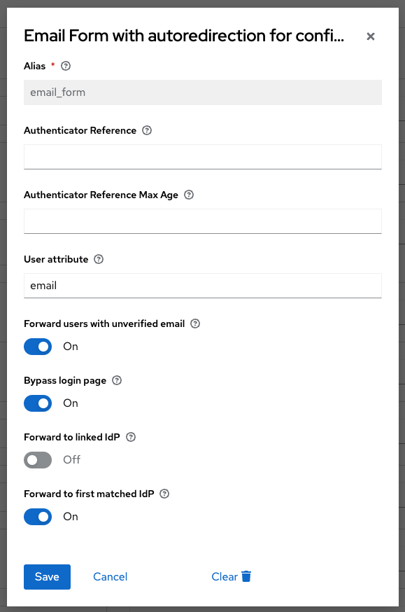
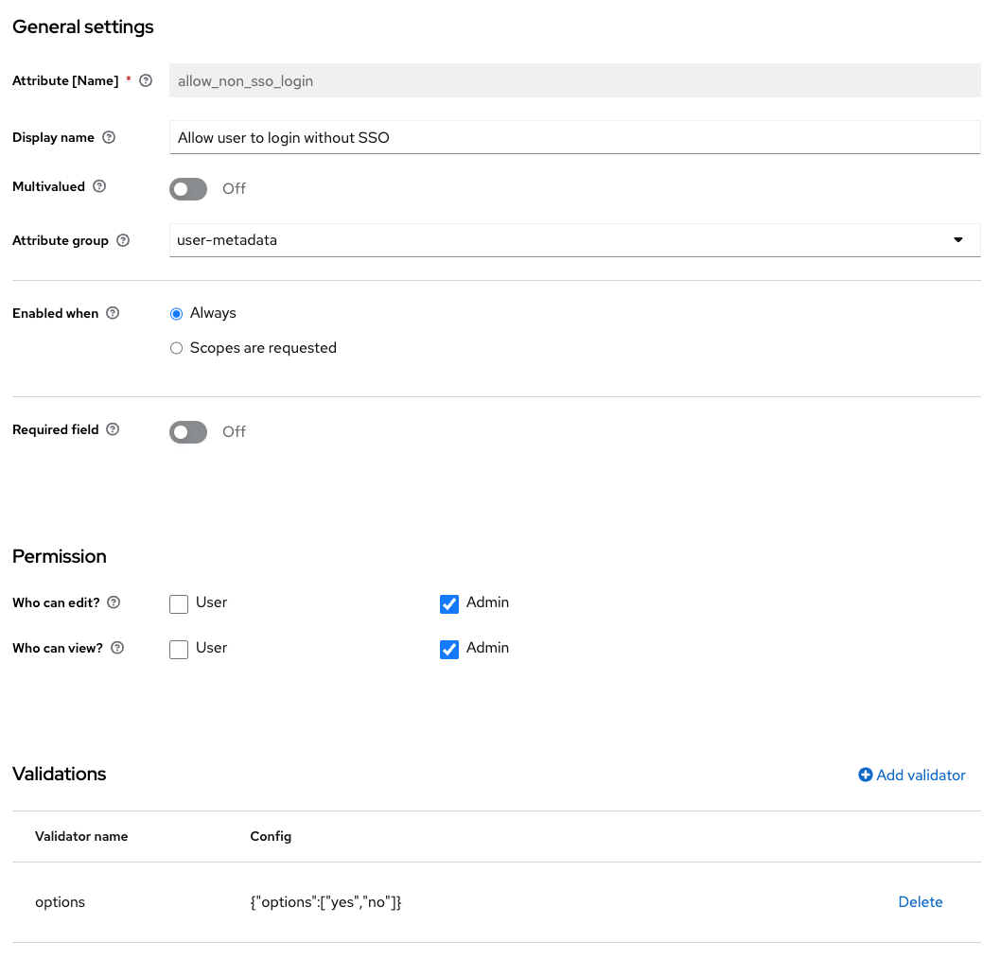
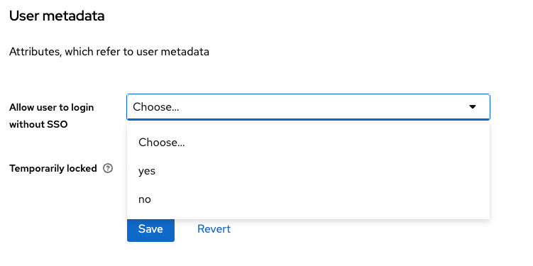

# Keycloak MagicLink Authenticator

## Preface
This extension is fork from the "Keycloak: Home IdP Discovery" extension found at https://github.com/sventorben/keycloak-home-idp-discovery.

Changes to the original include:

* Set the user to the context once the email has been entered. This allows to use the user in the following steps of the moodtalk authentication flow (e.g. Magiclink authentication or Password authentication)
* Introduce a user variable called `allow_non_sso_login` that if set to `yes` bypasses the IDP redirection and allows for a normal login

## About the extension

When a federated user wants to log in via Keycloak, Keycloak will present a username/password form 
and a list of configured identity providers to the user. The user needs to choose an identity 
provider to get redirected. This authenticator allows to skip the step of selecting an identity provider.

If this authenticator gets configured as part of a browser based login flow, Keycloak will present 
a username form (without password form and without list of configured identity providers). 
A user can then enter an email address. Keycloak will then choose an identity provider based on 
the domain part of the provided email address and forward the user to the chosen provider.

Documentation of the original extension can be found at: https://sventorben.github.io/keycloak-home-idp-discovery/

## Configuration

The authenticator can be configured in the Keycloak admin console. Usually it can serve as a one-to-one replacement for the username form.
The configuration options of the authentication step are documented at https://sventorben.github.io/keycloak-home-idp-discovery/configuration.html

For Moodtalk, we recommend to set the values to the following configuration:



## Allow Non SSO Login Setting

In order to bypass the SSO-Login Setting, a custom attribute must be added to the user profile in Realm Settings -> User Profile.
You want to use the following configuration and make sure that the options are "yes" and "no".



---

### Activate Non SSO Login for specific user

Once the custom attribute is added to the profile, it can be set on each individual user in the user profile:



Please note that if the value is set to "no", the user can still login without SSO as long as no domain 
redirection is configured for the email that is used. The following table shows the possible outcomes:

The domain **@moodtalk.ch** is configured to redirect to the IDP "Microsoft" 
whereas the domain **@otherdomain.com** has no redirection configured.

| Entered Email-Address | allow_non_sso_login | Outcome                                 |
|-----------------------|---------------------|-----------------------------------------|
| marcel@moodtalk.ch    | no                  | User is redirected to the Microsoft IDP |
| marcel@moodtalk.ch    | yes                 | User can login with a password          |
| marcel@moodtalk.ch    | blank / not set     | User is redirected to the Microsoft IDP |
| lucy@otherdomain.com  | no                  | User can login with a password          |
| lucy@otherdomain.com  | yes                 | User can login with a password          |
| lucy@otherdomain.com  | blank / not set     | User can login with a password          |

## Best practice to set the redirection domains

The configuration of email domains is described at https://sventorben.github.io/keycloak-home-idp-discovery/configuration.html#email-domains

Email domains can be configured per identity provider. 
Currently, this can only be achieved via Identity Providers REST API. 
Make sure to post the full body, as you may receive from a GET request to the same endpoint, plus the `home.idp.discovery.domains` configuration.

```
PUT /{realm}/identity-provider/instances/{alias}
{
  ...
  "config": {
    "home.idp.discovery.domains": "example.com##example.net",
    ...
  },
  ...
}
```

For the pre-configured identity provider for local development (okta), you can make a GET request to the following endpoint to retrieve the configuration:

```
http://idp.moodtalk.localhost/admin/realms/moodtalk/identity-provider/instances/okta
```

Copy all the response and send a put where you edit/add the `home.idp.discovery.domains` in the config part of the request.